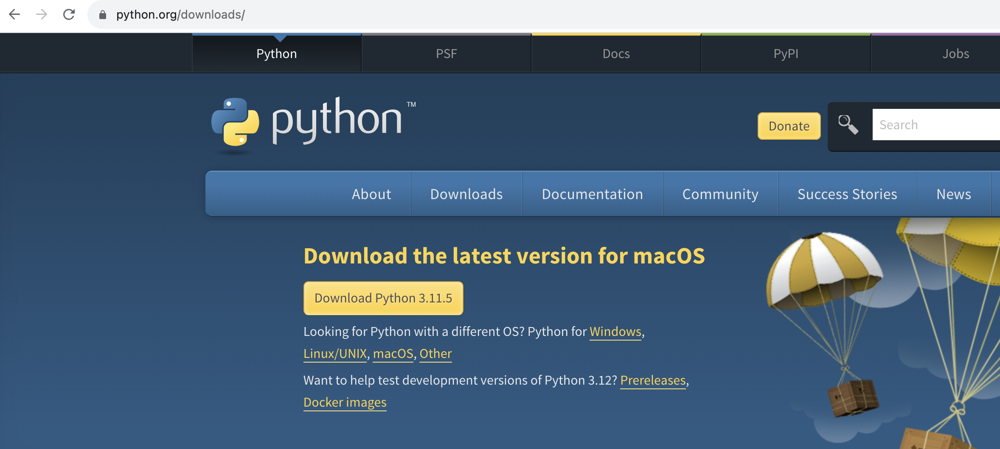
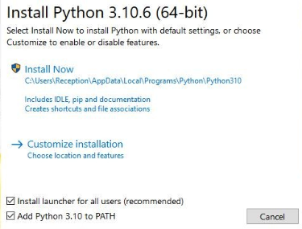
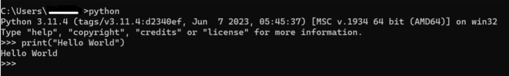
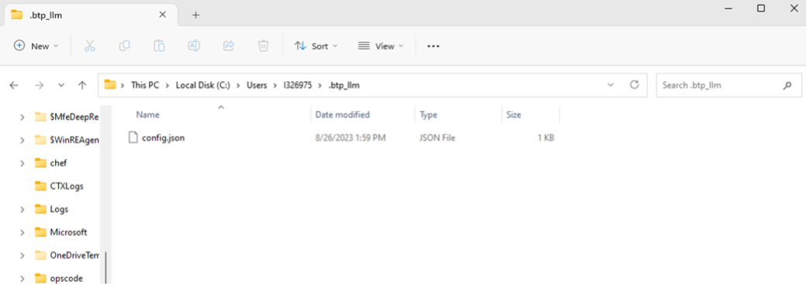
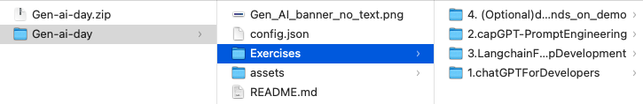
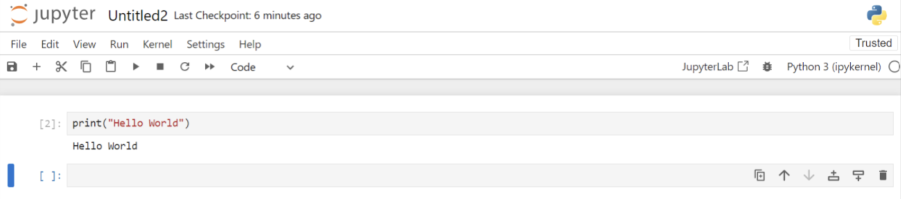
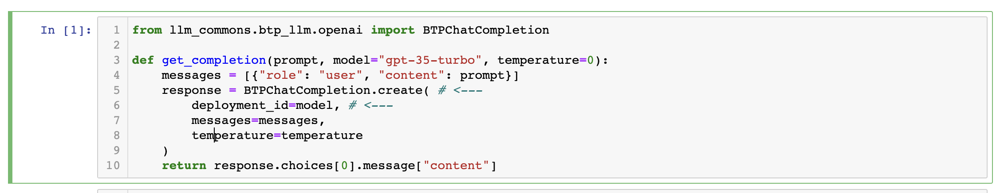
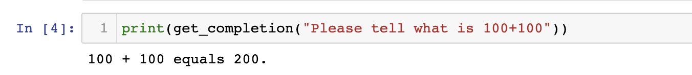

# Only for Experts - Preparing for SLI AI Day

We have set up an instance of SAP BTP large language model proxy service, so you can focus on the essential learnings for this journey. Some of these have been inspired from deeplearning.ai courses

 1. **Chat GPT for developers**: Delve into best practices for prompt engineering with Large Language Models (LLMs), emphasizing the advantages of instruction-tuned LLMs for developing applications and the importance of clear, specific instructions for optimal outcomes.

4. **Langchain for LLM  App development**: Explore the LangChain framework, a tool designed to simplify the process of developing applications with Large Language Models (LLMs): models, prompts, indexes, chains, and agents with coding exercises.

5. **capGPT Prompt Engineering**: Getting to know about some of the initial prompt engineering techniques used in the development of capGPT.

6. **(Back up)Beyond Chatbots: Integrate LLMs for Innovative Product Features - d-com (optional)**: This gives an example of how could we integrate LLMs into our products to have more innovative features.


# Instructions 
## please go through the info carefully before you start the process

- You need Python (>= 3.10) and a [notebook environment (Jupyter)](https://docs.jupyter.org/en/latest/install/notebook-classic.html) 

- Please note that if you already have Python & Jupyter with required versions, you can start directly from step 7

- For colleagues who are new to this can just follow along without creating virtual environment mentioned in the point below.

- **Only for experienced practitioners**, If you would like to, you may use [virtual environemnt](https://packaging.python.org/en/latest/guides/installing-using-pip-and-virtual-environments/) to  install the required libraries used in the hands-on.

- At minimum, Python versions >= 3.10 and Jupyter versions >= 4.11.2. As per standard policy, we recommend going to the latest versions of these to be secure.

**Follow the steps below to install Python & Jupyter notebook step by step**

## **Installing Python** 

### 1. **Check for Existing Installation** 
Open the terminal or cmd and type: 
``` 
python3 --version 
``` 


**Kindly note** that if your version is < 3.10, you need to update it.

### 2. **Download Installer** 
Go to the [official Python website](https://www.python.org/downloads/windows/) and download the latest version of Python for Windows or Mac. 



### 3. **Run Installer** 
 
- Launch the installer. 
- Ensure "Add Python PATH" is checked. This makes it easier to run Python from the command line. 
- Choose "Customize installation" (recommended for developers) or "Install Now" (typical settings). 
- Choose "Customize installation", ensure that "pip" and "tcl/tk" are selected for installation. 


- Once Python is installed verify if the PATH variable is set correctly as per the screenshot (Only for Windows)

 
### 4. **Verify Installation** 
Open cmd or terminal and type: 
``` 
python --version 
``` 
**Kindly note** that if your version is < 3.10, you need to update it.

### 5. **Further verify by writing a hello world**

Lets double ensure your installation with a basic "Hello World" example in Python: (write that in cmd or terminal)
```
print("Hello, World!")
``` 



### 6. **Install Jupyter OR JupyterLabs (either one of the two will be fine)
``` 
pip3 install jupyter
``` 

   ### **OR**

``` 
pip3 install jupyterlab
``` 


### 7. Open your cmd or terminal and run: 

```
pip3 install "sap-llm-commons[all]" --extra-index-url https://int.repositories.cloud.sap/artifactory/api/pypi/proxy-deploy-releases-hyperspace-pypi/simple --trusted-host int.repositories.cloud.sap
```

Once the above is successful, please run below as well in your cmd or terminal. This makes sure you have all the libraries required to run the exercises.

```
pip3 install langchain==0.0.218 openai docarray panel jupyter_bokeh redlines tiktoken wikipedia DateTime
```

### 8. Configure LLM instance key
1. You have to create a ".btp_llm" folder in the location as shown below. (Mac Users: If you face an error while creating a folder name starting with dot, then try this "Press ⌘ + ⇧ + ."  in the finder and then create folder again)
2. Inside that, you have to place the config.json from the code. 
3. For these exercises we provide the service key in the file config.json. In case you would like to try later with your own instance keys, here is the [process](https://github.tools.sap/I057149/azure-openai-service#to-use-this-service-in-your-application-follow-these-steps) .

Basically, ".btp_llm" folder needs to be created in your home directory. On Windows, that is usually, "C:\users\your_inumber\" See the example in the screenshot below.

Hint: Usually it should be your i/d number directory both in Mac & Windows as shown below.




### 9. **Open the Jupyter notebook** 
   
   You need to navigate (using the command line) to the folder, where you have placed the code
   


```
cd Exercises    
```
write the command (if you are using jupyter)
```
jupyter notebook
```

**OR**

write the below command (if you are using jupyter lab)
	
```
jupyter lab
```

### 10. **Running the cells** 

Access the Notebooks with the hands on activities: Open a web browser and access http://localhost:8888/tree 
You can try the exercises now.

**Execute the Cells**: Now press Shift+Enter or click the Run button to Run this cell.


### 11. **You should now see the desired output.** 




### 12. **Checking LLM installation in Jupyter** 

Run the code 
```
from llm_commons.btp_llm.openai import BTPChatCompletion

def get_completion(prompt, model="gpt-35-turbo", temperature=0):
    messages = [{"role": "user", "content": prompt}]
    response = BTPChatCompletion.create( # <---
        deployment_id=model, # <---
        messages=messages,
        temperature=temperature
    )
    return response.choices[0].message["content"]
```



### 13. **Verifying if the above function works** 

Run the code (you can give your prompt instead of 100+100)
```
print(get_completion("Please tell what is 100+100"))
```




# Troubleshooting 

The original source of inspiration for "Configure the environment" is [Install llm_commons](https://github.tools.sap/AI-Playground-Projects/llm-commons)
and then [configure LLMs](https://github.tools.sap/AI-Playground-Projects/llm-commons/tree/main/docs/btp_llm). You can use our service key in the
file config.json on the github page. In case you would like to try with your instance keys, here is the [process](https://github.tools.sap/I057149/azure-openai-service#to-use-this-service-in-your-application-follow-these-steps).

# Disclaimer

**Kindly note that the installations and downloads of the tools and applications referred to on this page are exclusively intended for learning purposes. For productive development of use cases, please refer to the information below appropriate for your use case:**
	
1.[SAP Product Development Use Cases](https://workzone.one.int.sap/site#workzone-home&/groups/keCuBI5DeVY8ywOSb8UHHa/overview_page/gj3GDUtNun86VWwHld3kpo)
	
2.[Internal Use Cases](https://sap.sharepoint.com/sites/205734/SitePages/DAB-AI-Factory.aspx)

# Conclusion 

Leverage Generative AI capabilities by following the instructions above. Enjoy experimenting and learning through these hands-on activities! If you have any issues or questions, feel free to reach out on [MSTeams](https://teams.microsoft.com/l/team/19%3aMmWA1zTKeImXEjzFo12zEsISMmW8M-u2_R8UcaGPsr81%40thread.tacv2/conversations?groupId=71379ecd-2fbf-4a63-a3b6-c5c2d82e8bf3&tenantId=42f7676c-f455-423c-82f6-dc2d99791af7). Later, when you will implement your own prototypes, we recommend creating your own instance of the SAP BTP LLM proxy service, as the one provided for this session will be deactivated shortly after the event concludes. 

 
