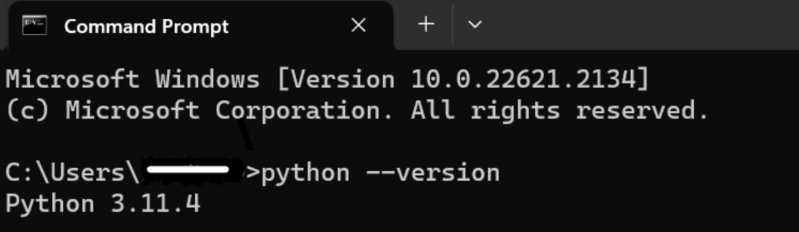
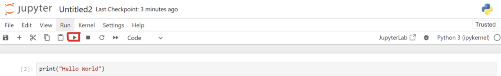

# Gen AI Day

We have set up an instance of SAP BTP large language model proxy service, so you can focus on the essential learnings for this journey. Some of these have been inspired from deeplearning.ai courses

 1. **Chat GPT for developers**: Delve into best practices for prompt engineering with Large Language Models (LLMs), emphasizing the advantages of instruction-tuned LLMs for developing applications and the importance of clear, specific instructions for optimal outcomes.

4. **Langchain for LLM  App development**: Explore the LangChain framework, a tool designed to simplify the process of developing applications with Large Language Models (LLMs): models, prompts, indexes, chains, and agents with coding exercises.

5. **capGPT Prompt Engineering**: Getting to know about some of the initial prompt engineering techniques used in the development of capGPT.

6. **(Back up)Beyond Chatbots: Integrate LLMs for Innovative Product Features - d-com (optional)**: This gives an example of how could we integrate LLMs into our products to have more innovative features.


# Instructions 
## please Confirm you have gone through the Prerequisite document before following the following steps.

## **Installing Python** 

### 1. **Check for Existing Installation** 
Open the terminal or cmd and type: 
``` 
python3 --version 
``` 



**Kindly note** that if your version is < 3.10, you need to update it.


### 2. **Open the Jupyter notebook** 
   
   You need to navigate (using the command line) to the folder, where you have placed the code
   


```
cd Exercises    
```
write the command (if you are using jupyter)
```
jupyter notebook
```

**OR**

write the below command (if you are using jupyter lab)
	
```
jupyter lab
```

### 3. **Running the cells** 

Access the Notebooks with the hands on activities: Open a web browser and access http://localhost:8888/tree 
You can try the exercises now.

**Execute the Cells**: Now press Shift+Enter or click the Run button to Run this cell.




# Troubleshooting 

The original source of inspiration for "Configure the environment" is [Install llm_commons](https://github.tools.sap/AI-Playground-Projects/llm-commons)
and then [configure LLMs](https://github.tools.sap/AI-Playground-Projects/llm-commons/tree/main/docs/btp_llm). You can use our service key in the
file config.json on the github page. In case you would like to try with your instance keys, here is the [process](https://github.tools.sap/I057149/azure-openai-service#to-use-this-service-in-your-application-follow-these-steps).

# Disclaimer

**Kindly note that the installations and downloads of the tools and applications referred to on this page are exclusively intended for learning purposes. For productive development of use cases, please refer to the information below appropriate for your use case:**
	
1.[SAP Product Development Use Cases](https://workzone.one.int.sap/site#workzone-home&/groups/keCuBI5DeVY8ywOSb8UHHa/overview_page/gj3GDUtNun86VWwHld3kpo)
	
2.[Internal Use Cases](https://sap.sharepoint.com/sites/205734/SitePages/DAB-AI-Factory.aspx)

# Conclusion 

Leverage Generative AI capabilities by following the instructions above. Enjoy experimenting and learning through these hands-on activities! If you have any issues or questions, feel free to reach out on [MSTeams](https://teams.microsoft.com/l/team/19%3aMmWA1zTKeImXEjzFo12zEsISMmW8M-u2_R8UcaGPsr81%40thread.tacv2/conversations?groupId=71379ecd-2fbf-4a63-a3b6-c5c2d82e8bf3&tenantId=42f7676c-f455-423c-82f6-dc2d99791af7). Later, when you will implement your own prototypes, we recommend creating your own instance of the SAP BTP LLM proxy service, as the one provided for this session will be deactivated shortly after the event concludes. 

 
